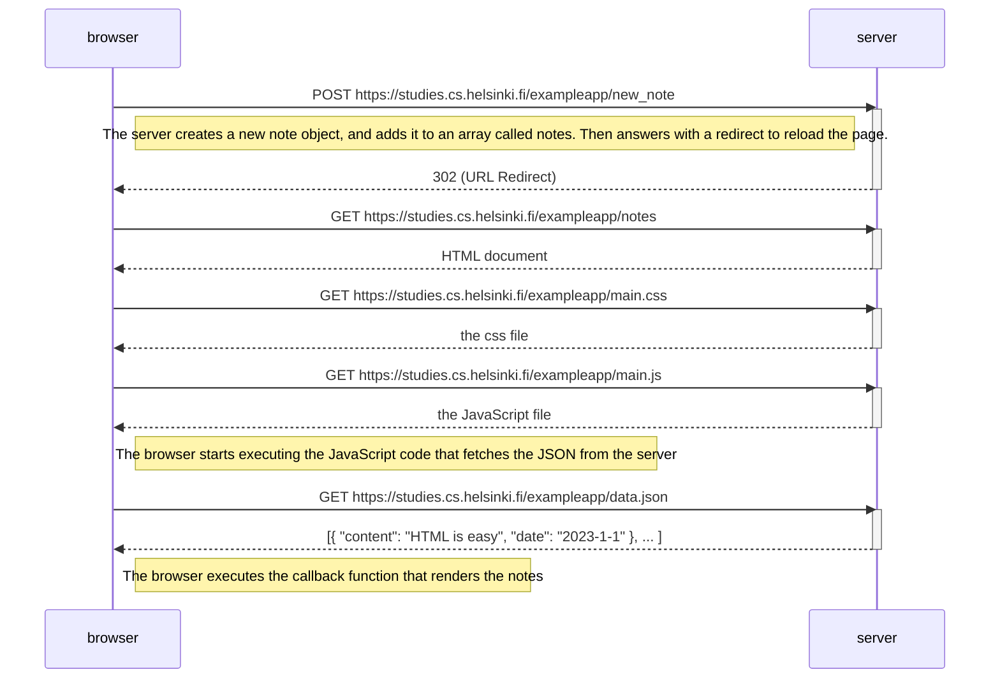

# Exercise 0.4: Diagram - adding new note
In this case the sequence diagram is almost identical to the original diagram, with the exception of adding the new note. The server responds with a rediret that triggers the re-loading of the wepage (and so of all the resources connected to it)

