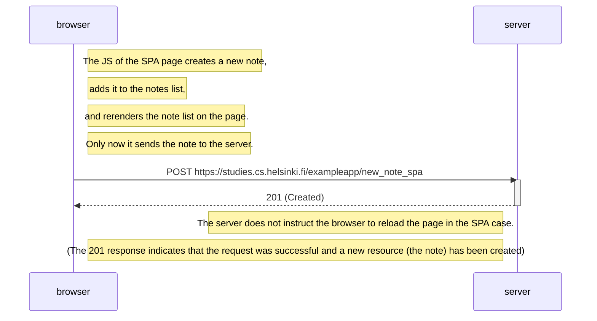

# Exercise 0.6: Diagram - adding new note in single page application case
In this case the sequence diagram is much simpler as the processing and re-rendering of the new note happens in browser, before the new note gets sent to the server. There are no redirects that make the browser make more calls to the server.

